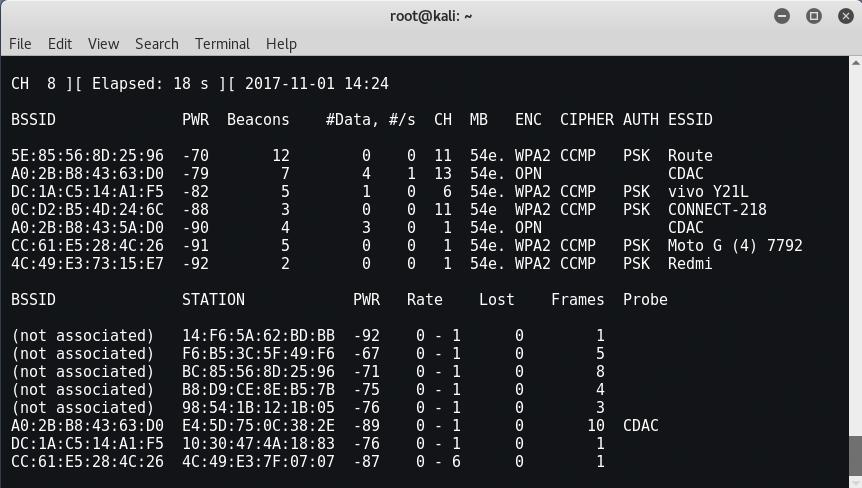
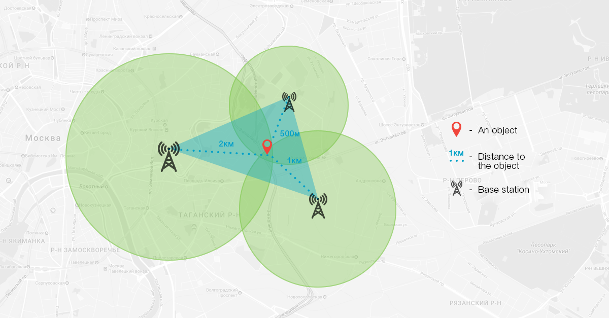
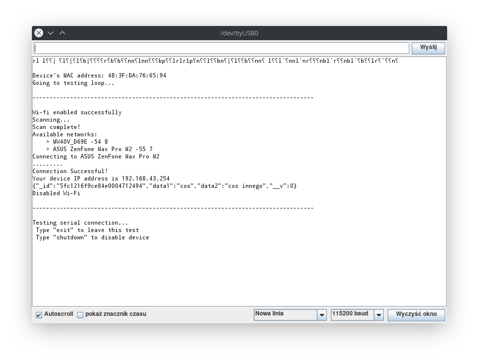

Postanowiliśmy stworzyć coś niebanalnego, co mogłoby zmienić świat, a także styl naszego życia. Każdy z nas korzysta w mniejszym lub większym stopniu z urządzeń obsługujących bezprzewodowe sieci Wi-Fi. Zdecydowana większość wie, że urządzenia mające połączenie z internetem da się inwigilować. Ale czy chociaż połowa tych osób ma świadomość, że włączone Wi-Fi w telefonie, nawet bez podłączenia do sieci, również pozwala na identyfikację i śledzenie użytkownika?

## Motywacja

Jako zespół, chcieliśmy stworzyć projekt pozwalający na zlokalizowanie ludzi za pomocą urządzeń telekomunikacyjnych, które przy sobie noszą. Samo tworzenie takiego narzędzia i odpowiedniego oprogramowania pozwala wiele się dowiedzieć o działaniu sieci bezprzewodowych. Stworzyliśmy więc 5 niewielkich urządzeń pozwalających na monitorowanie otoczenia sieciowego - każde urządzenie składa się w dużym uproszczeniu z modułu bezprzewodowego Wi-Fi i złącza micro USB. Dzięki swoim niewielkim wymiarom i zasięgowi do 15 metrów, stanowi wspaniałe narzędzie dla służb, umożliwiając śledzenie trasy danego użytkownika telefonu komórkowego lub otrzymanie informacji o nowym (nieznanym) urządzeniu na danym obszarze.

## Inspiracja

Narzędzie o nazwie "Oko Boga" pojawiło się w filmie "Szybcy i wściekli 7". Pozwalało ono na dostęp do każdej kamery podłączonej do sieci Internet, z kamerami w telefonach komórkowych włącznie. Dzięki temu możliwe było zlokalizowanie każdego, kto znalazł się w polu widzenia takiej kamery. Przeniesienie takiego projektu do rzeczywistości byłoby trudne, gdyby chcieć wykorzystywać kamery i sieć Internet. Z pomocą przyszedł znaleziony w internecie [projekt pozwalający na śledzenie ponad 500 osób](https://hackaday.io/project/174644-how-i-tracked-500-people-with-esp8266). Połączenie działającego projektu i inspiracji z filmu doprowadziło do rozpoczęcia pracy nad urządzeniami zbierającymi dane. Te dane, po przetworzeniu ich na serwerze, pozwoliłyby na określenie położenia urządzenia z dokładnością przynajmniej do 30 metrów, a w sytuacjach optymalnych, nawet do jednego metra, metodą podobną do lokalizacji użytkownika sieci komórkowej.

## Wykorzystane technologie

Urządzenia pracują pod kontrolą mikrokontrolera ESP8266EX zawartego w module ESP-12F. Programowany jest on za pomocą języka bazującego na C++, ale przeznaczonego dla płytek Arduino. Tym samym nasz projekt jest zgodny ze wszystkimi płytkami działającymi na modułach ESP-12E i ESP-12F. Serwer obsługujący dane nadchodzące z modułów pracuje na NodeJS, a otrzymane dane przechowywane są w MongoDB.

## Jak korzystać z projektu?

Ponieważ urządzenie jest przeznaczone do śledzenia ludzi, ewentualna infrastruktura nie może zostać udostępniona do użytku publicznego. Jednak można stworzyć własną infrastrukturę składającą się z przynajmniej jednego urządzenia i serwera WWW z bazą danych. By całość działała poprawnie, urządzenie musi znajdować się w zasięgu otwartej sieci Wi-Fi, aby móc przesyłać zebrane dane.

## Jak działa aplikacja?

### Urządzenie monitorujące otoczenie sieciowe

Moduł, działając w trybie monitora, zbiera wszelkie informacje o urządzeniach dostępnych w najbliższej okolicy. Po określonym czasie przełącza się w tryb klienta, umożliwiający połączenie z siecią Wi-Fi. Dzięki odpowiednio zaimplementowanemu algorytmowi, urządzenie automatycznie łączy się z najmocniejszą niezabezpieczoną siecią, niezależnie od jej nazwy. Po pomyślnej komunikacji z serwerem - przesłaniu danych i otrzymaniu odpowiedniej odpowiedzi zwrotnej - pętla programu rozpoczyna się od nowa, urządzenie odłącza się od sieci Wi-Fi i przełącza się w tryb monitora.

### Serwer przetwarzający dane

_Omówienie części serwerowej_

## Omówienie interfejsu

Ponieważ urządzenie nie posiada wyświetlacza, komunikacja i interakcja odbywa się za pomocą interfejsu szeregowego, z wykorzystaniem kabla microUSB. Jest to jednak rozwiązanie przydatne jedynie do przetestowania urządzenia, jego skonfigurowania i ewentualnego szukania błędów w działaniu. Dane zbierane przez narzędzie prezentowane są w aplikacji internetowej.

## Co się udało?

W chwili pisania tego dokumentu, mamy działający program testowy sprawdzający łączność z siecią Wi-Fi, komunikację z serwerem, komunikację z użytkownikiem i działanie przycisku. Oprócz tego, działa serwer WWW odbierający zapytania od urządzeń.

## Co się nie udało?

## Co można udoskonalić?

Należy poprawić komunikację urządzeń z serwerem, by uniknąć sytuacji, gdzie urządzenie nagle zostaje bez dostępu do sieci. W przypadku tworzenia większej sieci takich urządzeń, dobrym rozwiązaniem byłoby wykorzystanie protokołu ESP-NOW, pozwalającego na komunikację bezpośrednio między urządzeniami. Mogłoby to pozwolić na wyeliminowanie konieczności korzystania z sieci Internet, wykorzystując jedno z urządzeń jako odbiornik danych. Tym samym istniałaby możliwość lokalizacji tylko jednej osoby, bez naruszania prywatności innych osób w okolicy.
